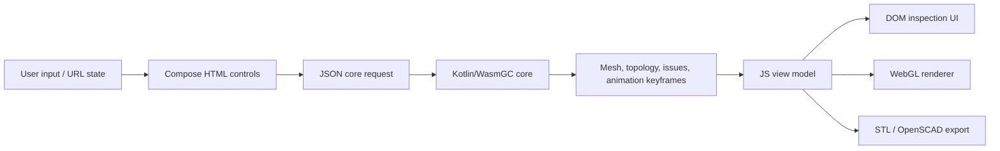

# Architecture

## Modules

| Module | Targets | Responsibility |
| --- | --- | --- |
| `model` | JVM, JS, WasmGC | Serializable mesh/presentation types, vector math needed for rendering and inspection, and the browser core-request/response contract. It contains no seed generator or manipulation transform. |
| `core` | JVM, JS, WasmGC | Seed construction, topology manipulation, transforms, scaling, validation, browser API evaluation, and JVM tests. The browser executes this module only as WasmGC; its JS target exists solely for the controlled baseline benchmark. |
| `web` | JS | Compose HTML controls, URL parameter state, animation interpolation, inspection/export UI, and the WebGL renderer. It consumes completed meshes and metadata; it does not invoke manipulation transforms. |
| `benchmarks` | JS, WasmGC | Identical production benchmark workloads over the core algorithms. |

## Browser runtime



`CoreClient.kt` is the only browser-to-core invocation boundary. It dynamically imports the generated Wasm module, sends a serialized `CoreRequest`, and decodes `CoreResponse`. The generated Kotlin loader and one dynamic-import expression are the only JavaScript interop required for core execution. The production web bundle depends on `model`, not `core`, so it cannot contain a JavaScript fallback copy of the manipulation engine.

The Wasm core owns:

- seed geometry construction;
- truncate, rectify, cantellate, dual, bevel, snub, chamfer, canonical, and drop operations;
- size guards, applicability checks, warnings, and progress;
- scale normalization and topology/drop analysis;
- topology-changing animation keyframe construction.

The JS application owns DOM composition, user events, hash serialization, interpolation between returned keyframes, render-buffer generation, WebGL drawing, and file download.

## State and data flow

`RootParams` is the canonical UI state. Its compact serialization is stored after `#/` in the URL, so reloads and copied links reproduce the current seed, transform chain, view, lighting, animation, and export settings.

Every seed/transform/scale change creates a `CoreState`. Results from superseded requests are ignored. A response contains the scaled display mesh, unscaled intermediate meshes, valid transform tags, per-stage droppable kinds, structured issues, progress, and optional animation steps. Compose receives an explicit core-update signal so asynchronous results and progress are rendered immediately.

## Build outputs

`browserDevelopmentDistribution` and `browserProductionDistribution` assemble one deployable directory:

```text
build/dist/browser/<mode>/
├── index.html
├── PolyhedraExplorer.js
├── css/
└── core/
    ├── PolyhedraExplorer-core.mjs
    ├── PolyhedraExplorer-core.wasm
    └── generated Kotlin/Wasm support modules
```

The site must be served over HTTP; loading it directly from the filesystem is unsupported because the Wasm module is fetched as an ES module.

## Invariants

- Browser manipulation algorithms execute through `evaluateCoreJson` in WasmGC.
- The JS bundle contains the mesh presentation model and Wasm loader, but no seed-generation or transform implementation.
- The UI renders with DOM + WebGL; no canvas UI toolkit owns the controls.
- Transform order is significant and intermediate topology metadata corresponds to the same order.
- A displayed polyhedron never exceeds 32,767 edges.
- JS and Wasm benchmarks run the same common source and must produce the same checksum.
