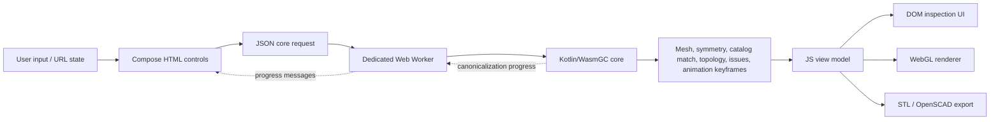

# Architecture

## Modules

| Module | Targets | Responsibility |
| --- | --- | --- |
| `model` | JVM, JS, WasmGC | Serializable mesh/presentation types, shared concave/non-planar face triangulation, vector math needed for rendering and inspection, the browser core-request/response contract, and shared typed transform notation and macro definitions. It contains no seed generator or manipulation transform. |
| `core` | JVM, JS, WasmGC | Seed construction, topology manipulation, transforms, scaling, validation, browser API evaluation, and JVM tests. The browser executes this module only as WasmGC; its JS target is limited to the controlled baseline benchmark and standalone diagnostic renderer. |
| `web` | JS | Compose HTML controls, URL parameter state, animation interpolation, inspection/export UI, and the WebGL renderer. It consumes completed meshes and metadata; it does not invoke manipulation transforms. |
| `benchmarks` | JS, WasmGC | Identical production benchmark workloads over the core algorithms. |
| `renderer` | JS (Node) | Standalone diagnostic PNG rendering with the core JS target, the web module's real shaders, `headless-gl`, and `pngjs`. It has no browser, DOM, HTTP-server, or Wasm-worker dependency. |

## Source layout and package names

Kotlin sources use a compact directory layout. Every package starts with `polyhedra.<module>`, followed by the source file's relative directory beneath the source set's `kotlin` directory. The source-set name is not part of the package.

| Source path | Package |
| --- | --- |
| `model/src/commonMain/kotlin/poly/Polyhedron.kt` | `polyhedra.model.poly` |
| `core/src/commonMain/kotlin/api/CoreApi.kt` | `polyhedra.core.api` |
| `core/src/jsMain/kotlin/util/RunSynchronously.kt` | `polyhedra.core.util` |
| `web/src/jsMain/kotlin/main/RootPane.kt` | `polyhedra.web.main` |
| `benchmarks/src/commonMain/kotlin/BenchmarkMain.kt` | `polyhedra.benchmarks` |
| `renderer/src/jsMain/kotlin/Renderer.kt` | `polyhedra.renderer` |

A file directly under a source set's `kotlin` directory uses the module root package, such as `polyhedra.core` or `polyhedra.web`. Do not duplicate the namespace as physical `polyhedra/<module>` directories and do not use `package-info.kt` marker files. Imports across module and subpackage boundaries must name the owning package explicitly.

## Browser runtime



`CoreClient.kt` is the browser-to-core invocation boundary. It owns a dedicated Web Worker, sends a serialized `CoreRequest`, receives progress messages, and decodes `CoreResponse`. The small `core-worker.js` shim dynamically imports the generated Wasm module and relays JSON messages; it contains no manipulation logic. The build derives one fingerprint from the application version and browser-runtime inputs, applies it to the main script, stylesheet, and worker URLs, and puts the complete Wasm output in `core-<fingerprint>/`. A runtime change therefore gets new asset URLs automatically, preventing a cached core from returning an incompatible response to a newer JS client. Canonicalization and every other core operation execute as WasmGC off the browser's main thread. Starting a newer request terminates an in-progress worker so stale expensive work cannot block the next result.

Propeller, Whirl, and Quinto first build their exact local Conway incidence structure, apply a small orbit-preserving radial perturbation to avoid a degenerate circle-packing start, and then use the same progress-capable canonical solver to return a convex realization. Their final geometry is cached by input polyhedron and chirality. Progress identifies the active logical transform index and reports a stage-local percentage; multiple primitive operations inside one macro are mapped into a monotonic `0…100` range for that macro pill.

The generated Kotlin loader and the worker's dynamic-import expression are the only JavaScript interop required for core execution. The production web bundle depends on `model`, not `core`, so it cannot contain a JavaScript fallback copy of the manipulation engine.

The separate `renderer` executable is a development diagnostic, not a browser fallback. It parses
the same `RootParams` serialization, evaluates the `CoreRequest` through the core's Kotlin/JS Node
target, applies the resulting `CoreResponse` to the web view model, and passes a `headless-gl`
context to the same `DrawContext`, buffer builders, shader sources, lighting, and environment passes
used by the browser. It reads RGBA pixels from that context, flips WebGL's bottom-up rows, and uses
`pngjs` only for PNG encoding. Its Gradle setup owns Node/npm provisioning and the native addon
installation; `tools/render-config.ps1` only converts Unicode arguments safely and invokes the
Gradle task.

Canonical representation invariants and the current circle-packing solver are specified in [Canonicalization](canonicalization.md). The solver validates rotational kind groups, relaxes only one edge point and face plane per symmetry orbit, and expands the converged vertex planes through precomputed proper rotations once during final reconstruction.

The Wasm core owns:

- seed geometry construction;
- primitive transform and macro-expansion evaluation, including composition-aware `aa` cantellation and `at` bevel fusion;
- truncate, rectify, cantellate, dual, bevel, snub, propeller, whirl, quinto, chamfer, canonicalization (the UI's `Canonical` transform), Greaten, Stellate, drop, and orbit-targeted Kis/Stellate/Truncate/Rectify/Radial geometry kernels;
- regular Kepler-Poinsot face arrangements and their nonzero-winding embedded physical-boundary resolution;
- generic Greatened construction by full-point-group face-orbit enumeration and progress-reporting exact-cover faceting of the polar dual, followed by reciprocal reconstruction, an integer generalized-winding closure filter, and geometry-only result ordering;
- normalized face-plane-arrangement construction for Stellated, including orbit-representative bounded diagrams expanded by geometric symmetries, spatially indexed intersections, symmetric circuit candidates, lazily materialized main-line cell-power boundaries, compound filtering, phased progress, bounded LRU reuse, and discrete Result metadata shared with Greatened. Every cached result owns lazily computed geometry-contract analysis, full point-group and F/E/V orbit classification, core-derived orbit-action tags, and most recent presentation-rim geometry, so returning to it does not repeat that post-processing;
- tessellation-free hidden-face rim regions, including dihedral-aware opening widths, shared equal-offset joins bounded at local rim or face-collapse boundaries, uninterrupted one-sided immersed source-edge sheets, width limits, and source-edge provenance;
- size guards, applicability checks, warnings, and progress;
- fixed and parameterized-family seed geometry, scale normalization, and topology/drop analysis;
- rotation-orbit refinement and geometric comparison with built-in seeds;
- geometric full-point-group analysis, actual F/E/V proper-rotation orbits, rotation-axis directions, and reflection-plane normals;
- topology-changing animation keyframe construction.

Every primitive declares a machine-readable geometry domain: minimum input contract, face-plane or local-face requirement, topology requirement, locality, and output policy. The evaluator checks that record before construction and maps a rejection to `TransformNotApplicable`; it validates every completed primitive against the declared output contract. Truncate, Rectify, Dual, Cantellate, Bevel, and orbit-targeted cuts may therefore consume and return renderable immersions without treating intentional transverse crossings as corruption, while plane-based operations reject non-planar or center-crossing authoritative faces before division or construction. Snub preserves an embedded input's stronger contract so unsafe low-inset Gyro results remain outside its dynamic range.

Continuous transform settings are stored as dimensionless multipliers in the
logical transform tag. A regular/default multiplier of `1` is never serialized;
non-default values use compact suffixes such as `t~d=0.7`. The shared `model`
codec is used by both the JS URL model and the Wasm core, so parsing cannot drift
between runtimes. `TransformOperation` is the single source of truth for each
operation's compact tag. A serialized tag is parsed at the URL/core-contract edge
into a `TransformId` (operation, chirality, and optional orbit target) and a
`TransformSpec` (identity plus tweaks); macro expansion, core evaluation,
animation, and UI selection use those typed values rather than comparing strings.
The core maps macro controls onto their geometric primitive
(for example Bevelled distance/depth onto the fused bevel kernel) and returns
direct same-topology interpolation or topology-compatible cut keyframes between
source and target parameter realizations. For every parameterized stage, the worker
tests the operation against the actual unscaled input mesh and final display
scale, then returns the connected geometry-safe interval for each control while
holding the other controls at their selected values. Shared static bounds are
only outer exploration envelopes. The DOM slider rounds the returned interval
inward to its 1% step, and the core rejects any parameterized result that fails
finite-coordinate, manifold-edge, connectedness, triangle-orientation, or surface-intersection validation before
it can reach WebGL.

The mesh contract is split by concern: [Non-convex geometry](non-convex.md) owns simple concave and
non-planar faces, [Self-intersecting polyhedra](self-intersections.md) owns immersion and the Resolved transform,
and [Export](export.md) owns printable conversion. Every face consumer uses the model's supplied
resolved-face triangles, so validation checks the same surface later rendered, picked, animated,
and exported.

The JS application owns DOM composition, user events, hash serialization, interpolation between returned keyframes, render-buffer generation, WebGL drawing, and file download. One document-level keyboard dispatcher maps unmodified keys to the same model actions used by the visible seed, transform, orbit, visibility, symmetry, rotation, and popup controls; editable DOM targets suppress it so native typing and slider/dropdown navigation win, while Escape remains globally available to dismiss the current popup. The right-column help popup derives its rows from the same command declarations and shows a build-generated application version: local builds use the Gradle project version, while release CI injects the semantic-version tag. F/E/V rollover is transient JS state: popup rows and CPU-side front-face canvas picking update the same orbit-kind selection. Face picking uses the full resolved presentation surface independently of manual visibility. WebGL consumes that selection through face modes, a selected-edge index overlay, or generated vertex-marker geometry. Face fragments are shaded in linear light with one opaque-dielectric Cook-Torrance evaluation (GGX distribution, correlated Smith visibility, Schlick Fresnel from IOR, and energy-conserving Lambert diffuse) plus a constant-environment approximation. Face-buffer generation normally assigns orbit colors; enabled print preview instead converts its serialized OKLCH material color to gamut-mapped sRGB once per update and assigns it to every face, rim, inner surface, and wall without changing geometry or shaders. The edge context suppresses both normal and rollover edge passes in this mode, leaving only the material surfaces. The Cut view also leaves render buffers unchanged: vertex shaders pass view-space depth and fragment shaders discard face, edge, vertex-marker, and table-shadow samples in front of a screen-parallel plane. Its signed offset is multiplied by the current view scale because the core mesh is normalized to the selected base-scale radius. Face drawing temporarily disables back-side culling while Cut is active, exposing reverse surfaces, then restores the previous GL state. One fixed key-light position is shared by every environment. The optional Table environment runs before the polyhedron pass: it draws a rough neutral dielectric plane, then projects the current animated face-buffer positions analytically from that same key onto the plane. Stencil unioning gives the sharp shadow one opacity contribution per receiver pixel, while separate RGB/alpha blending darkens the opaque table without exposing the page background. This produces a cast shadow without shadow maps, textures, offscreen framebuffers, extra light samples, or additional core geometry. The bottom symmetry pill renders the core-provided full Schoenflies point group with a semantic HTML subscript. The symmetry overlay triangulates reflection-plane normals into translucent circular disks and expands rotation-axis directions into thin black lines through the origin. Its serialized visibility parameter and View size parameters preserve the toggle and scale disk radii and axis half-lengths relative to the current circumradius. Edge-popup figures unfold each representative edge's adjacent faces around a centered vertical shared edge; the model projection preserves the edge's directed `l`/`r` ordering and the DOM renderer applies the corresponding face-orbit colors.

Hidden-face buffers triangulate the worker's polygonal rim regions and build opening walls on final
outer and hole cycles. Their inner shell uses shared equal-offset face-plane intersections for both
embedded and immersed surfaces. Immersed top rims keep their configured width; only the underside
tapers when a join reaches the inner rim boundary or another boundary of an incident face. Bounding
the common collapse point prevents acute miters from inverting while preserving connected corners.
These buffers feed WebGL and the table-shadow pass. STL is a separate Wasm consumer of
authoritative geometry and presentation settings; OpenSCAD is a polygonal JS consumer.
Neither reads WebGL buffers, and their distinct pipelines are specified in [Export](export.md).

## State and data flow

`RootParams` is the authoritative UI state. Its compact serialization is stored after `#/` in the URL, so reloads and copied links reproduce the current seed, transform chain, view, environment, lighting, print preview, animation, and export settings. URL parsing precedes asynchronous core startup and canvas mounting; when the WebGL `ViewContext` is later created, it eagerly initializes its model and normal matrices from the already-loaded rotation and scale instead of waiting for a non-replayable load notification. Cut is stored inside View as `c(y)` when enabled and `cp(...)` for a non-default signed position. The default `Table` environment has no tag; `None` is serialized as `env(n)` inside View state. Print preview uses the sibling `p(...)` render composite: `e(y)` enables it, while non-default `l`, `c`, and `h` store OKLCH lightness, chroma, and hue.

Saved configurations reuse that serialization without translation. Each append creates one independent JSON record under the versioned local-storage prefix `polyhedra-explorer.save.v1.`; the record contains its format version, stable ID, display name, epoch timestamp, exact `RootParams` URL string, and image data URL. Independent records avoid rewriting history and allow malformed or unrelated storage entries to be skipped without hiding valid saves. Loading assigns the stored state to the hash and reloads the application, so parameters omitted because they were defaults reset correctly. There is no deletion path.

The canvas controller fulfills preview requests immediately after a fresh WebGL draw, before the drawing buffer can be discarded. It center-crops the canvas to 4:3, composites it over the neutral application background, scales it to `240 × 180`, and encodes it as a compact WebP data URL. The popup never screenshots its own DOM; the saved image therefore contains only the configured scene.

Rollover selections and orbit-target navigation memory are deliberately excluded from `RootParams` serialization. Rollovers are cleared when the pointer leaves the canvas or the active popup changes, and are recomputed on rendered animation frames while the pointer remains stationary so automatic rotation cannot leave a stale selection. The UI model keeps independent last-used face, edge, and vertex orbit targets; every targeted chain update refreshes them, while operation changes reuse the remembered target only when it is supported at that transform stage.

Every seed/transform/scale change creates a `CoreState`. Results from superseded requests are ignored. A response contains the scaled display mesh, actual proper-rotation class and F/E/V orbits, distinct rotation-axis directions, reflection-plane normals, an optional recognized catalog-seed tag, unscaled intermediate meshes, valid transform tags, per-stage available orbit-targeted transforms, per-stage geometry-safe continuous-control ranges, structured issues, and optional animation steps. Geometry-contract analysis, point-group/orbit classification, and orbit-action availability are core responsibilities; cached Greatened and Stellated candidates retain all three records beside the candidate mesh, and the response reuses those exact records. The core builds a directed-edge orthonormal frame, enumerates candidate orientation-preserving and orientation-reversing mappings, and accepts only mappings whose vertex permutation preserves every edge and every complete directed face circuit; immersed faces are never matched merely because they contain the same unordered vertices. Proper mappings classify `C<n>`, `D<n>`, `T`, `O`, or `I`, form element orbits, and yield the unoriented fixed axes of every non-identity rotation; improper involutions with a two-dimensional fixed set provide the reflection planes. Selective Truncate vertex and Rectify vertex build topology-compatible parameterized keyframes; changing their target returns an old-target-out step followed by a new-target-in step, while changing between those operations on one target interpolates the shared cut ratio directly. Continuous settings with matching topology interpolate directly; orbit-targeted cut settings reuse their parameterized keyframes. Propeller, Whirl, and Quinto use their final topology laid flat as an exact subdivision of the input surface, then morph it into the canonical coordinates. A multi-part macro emits one fused animation step: the core maps every vertex of the final topology to an input origin, moves that collapsed mesh to the exact macro result, and gives all primitive components the same normalized progress. Apply and removal use the same configured duration in opposite directions; continuous macro settings are incorporated into the final target. A default replacement gives the old-out and new-in operation phases the configured duration. Identity logical operations are normalized to absence before either primitive or macro animation is built, so empty Canonical uses exactly the same path as no transform. Direct compatible pairs keep one stage; any remaining stationary stages are filtered and the visible stages retain the operation's total duration. Changing the target of selective Kis remains immediate, while changing Height on the same target is safe to interpolate. Drop, selective-Kis insertion/removal, chirality flips, and Dual on an immersed input intentionally return no keyframes because they have no stable non-self-intersecting correspondence. Greatened or Stellated Result changes are also immediate and do not evaluate the previous large candidate merely to produce an empty animation. Transform evaluation is authoritative and animation is best-effort: keyframe construction and lazy presentation materialization run only after the current transform result succeeds; an animation exception is logged with its stack trace and yields an empty animation without changing the successful response or showing a transform failure in the UI. The first progress message can only arrive after the worker has imported the Wasm module, so it ends the central loading state. Each newly reported logical transform stage starts its own 500 ms visibility timer; its latest percentage is retained but the pill stays unchanged until the timer elapses. Stage completion, replacement, or request cancellation clears the timer, so fast work cannot leave a stale flash. Subsequent progress messages carry the active logical transform index and its percentage, making the spinner follow the pill whose operation is running; reaching `100%` clears that pill before response and animation post-processing. Genuine worker failures retain the last reported transform index so any pill error is assigned to the stage that was actually executing. A seed change cannot animate, so the worker does not reevaluate the old seed's transform chain merely to produce an empty animation. The main script, worker, and Wasm directory share an explicit bundle version; it is advanced for core implementation or contract changes so an ordinary browser refresh cannot combine current UI code with an older cached worker. Compose scopes subscribe directly to the relevant `Param` update types, so asynchronous results and progress invalidate only the UI that observes them.

When the seed or serialized transform chain changes, including any continuous or discrete transform setting, the request explicitly asks the Wasm worker to detect a catalog seed. After a complete, successful chain, the core filters catalog seeds by FEV and compares circumradius-normalized, orientation-sensitive local edge projection classes; catalog fingerprints for both handed variants are cached. The comparison operates on the resulting immersed surface's local edge figures and does not require an embedded planar graph. Transform names, expansions, and parameter defaults do not participate in catalog equivalence. A chiral match therefore returns the exact base or prime-suffixed seed tag. The JS view model presents that tag as an optional action to the right of the transform chain. The exploratory state is preserved until the user accepts the suggestion, which atomically replaces the seed and clears the transform list. Scale-only, animation, and other view/config updates do not change geometry and therefore do not rerun detection. Partial or failed chains never offer a replacement.

Prefix-replacement detection is a separate, synchronous notation operation in the JS UI. The UI displays the applied end of the logical transform list as its left prefix. The shared `model` finder expands macros, cancels adjacent Dual pairs, and checks logical suffixes from longest to shortest against every single primitive and macro, keeping `s`/`s'` and `g`/`g'` distinct. Accepting the suggestion atomically replaces only that prefix with the equivalent formal Conway operation and handedness. It may expose `aa`/`at` composition fusion and therefore select the regularized coordinate realization; no state changes until the user accepts the proposal.

## Build outputs

`browserDevelopmentDistribution` and `browserProductionDistribution` assemble one deployable directory:

```text
build/dist/browser/<mode>/
├── index.html
├── PolyhedraExplorer.js
├── core-worker.js
├── css/
└── core-<fingerprint>/
    ├── PolyhedraExplorer-core.mjs
    ├── PolyhedraExplorer-core.wasm
    └── generated Kotlin/Wasm support modules
```

The site must be served over HTTP; loading it directly from the filesystem is unsupported because the Wasm module is fetched as an ES module.

## Invariants

- Browser manipulation algorithms execute through `evaluateCoreJson` in WasmGC inside a dedicated worker.
- A core implementation or serialized-contract change increments the main-bundle query, worker filename, and Wasm asset directory together.
- CPU-intensive transforms cannot block DOM/WebGL interaction, and worker messages repaint progress on the main thread.
- The JS bundle contains the mesh presentation model and Wasm loader, but no seed-generation or transform implementation.
- The UI renders with DOM + WebGL; no canvas UI toolkit owns the controls.
- Transform order is significant and intermediate topology metadata corresponds to the same order.
- A macro occupies one logical transform stage even though the core may execute several primitive operations for it.
- A displayed polyhedron never exceeds 32,767 edges.
- Every displayed polyhedron satisfies at least the renderable-immersion contract. Resolved output
  and every successful STL satisfy the stronger connected embedded-boundary contract; compounds
  are rejected, while simple non-planar faces remain valid through their shared triangulation.
- JS and Wasm benchmarks run the same common source and must produce the same checksum.
