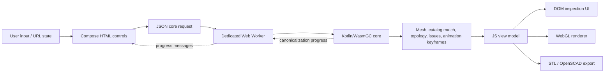

# Architecture

## Modules

| Module | Targets | Responsibility |
| --- | --- | --- |
| `model` | JVM, JS, WasmGC | Serializable mesh/presentation types, vector math needed for rendering and inspection, the browser core-request/response contract, and shared string-only macro definitions. It contains no seed generator or manipulation transform. |
| `core` | JVM, JS, WasmGC | Seed construction, topology manipulation, transforms, scaling, validation, browser API evaluation, and JVM tests. The browser executes this module only as WasmGC; its JS target exists solely for the controlled baseline benchmark. |
| `web` | JS | Compose HTML controls, URL parameter state, animation interpolation, inspection/export UI, and the WebGL renderer. It consumes completed meshes and metadata; it does not invoke manipulation transforms. |
| `benchmarks` | JS, WasmGC | Identical production benchmark workloads over the core algorithms. |

## Source layout and package names

Kotlin sources use a compact directory layout. Every package starts with `polyhedra.<module>`, followed by the source file's relative directory beneath the source set's `kotlin` directory. The source-set name is not part of the package.

| Source path | Package |
| --- | --- |
| `model/src/commonMain/kotlin/poly/Polyhedron.kt` | `polyhedra.model.poly` |
| `core/src/commonMain/kotlin/api/CoreApi.kt` | `polyhedra.core.api` |
| `core/src/jsMain/kotlin/util/RunSynchronously.kt` | `polyhedra.core.util` |
| `web/src/jsMain/kotlin/main/RootPane.kt` | `polyhedra.web.main` |
| `benchmarks/src/commonMain/kotlin/BenchmarkMain.kt` | `polyhedra.benchmarks` |

A file directly under a source set's `kotlin` directory uses the module root package, such as `polyhedra.core` or `polyhedra.web`. Do not duplicate the namespace as physical `polyhedra/<module>` directories and do not use `package-info.kt` marker files. Imports across module and subpackage boundaries must name the owning package explicitly.

## Browser runtime



`CoreClient.kt` is the browser-to-core invocation boundary. It owns a dedicated Web Worker, sends a serialized `CoreRequest`, receives progress messages, and decodes `CoreResponse`. The small `core-worker.js` shim dynamically imports the generated Wasm module and relays JSON messages; it contains no manipulation logic. Canonicalization and every other core operation therefore execute as WasmGC off the browser's main thread. Starting a newer request terminates an in-progress worker so stale expensive work cannot block the next result.

The generated Kotlin loader and the worker's dynamic-import expression are the only JavaScript interop required for core execution. The production web bundle depends on `model`, not `core`, so it cannot contain a JavaScript fallback copy of the manipulation engine.

Canonical representation invariants and the current circle-packing solver are specified in [Canonicalization](canonicalization.md). The solver validates rotational kind groups, relaxes only one edge point and face plane per symmetry orbit, and expands the converged vertex planes through precomputed proper rotations once during final reconstruction.

The Wasm core owns:

- seed geometry construction;
- primitive transform and macro-expansion evaluation, including composition-aware `aa` cantellation and `at` bevel fusion;
- truncate, rectify, cantellate, dual, bevel, snub, chamfer, canonicalization (the UI's `Canonical` transform), and drop geometry kernels;
- size guards, applicability checks, warnings, and progress;
- scale normalization and topology/drop analysis;
- rotation-orbit refinement and geometric comparison with built-in seeds;
- topology-changing animation keyframe construction.

The JS application owns DOM composition, user events, hash serialization, interpolation between returned keyframes, render-buffer generation, WebGL drawing, and file download. F/E/V rollover is transient JS state: popup rows and CPU-side front-face canvas picking update the same orbit-kind selection. Face picking uses the full virtual polygon independently of manual visibility, while excluding non-planar faces that have no reliable surface. WebGL consumes that selection through face modes, a selected-edge index overlay, or generated vertex-marker geometry.

## State and data flow

`RootParams` is the authoritative UI state. Its compact serialization is stored after `#/` in the URL, so reloads and copied links reproduce the current seed, transform chain, view, lighting, animation, and export settings.

Rollover selections are deliberately excluded from `RootParams` serialization. They are cleared when the pointer leaves the canvas or the active popup changes, and are recomputed on rendered animation frames while the pointer remains stationary so automatic rotation cannot leave a stale selection.

Every seed/transform/scale change creates a `CoreState`. Results from superseded requests are ignored. A response contains the scaled display mesh, an optional recognized catalog-seed tag, unscaled intermediate meshes, valid transform tags, per-stage available orbit-targeted transforms, structured issues, and optional animation steps. Progress arrives as separate worker messages. Compose scopes subscribe directly to the relevant `Param` update types, so asynchronous results and progress invalidate only the UI that observes them.

When the seed or transform chain changes, the request explicitly asks the Wasm worker to detect a catalog seed. After a complete, successful chain, the core filters catalog seeds by FEV and compares circumradius-normalized, orientation-sensitive local edge projection classes; catalog fingerprints for both handed variants are cached. A chiral match therefore returns the exact base or prime-suffixed seed tag. The JS view model presents that tag as an optional action to the right of the transform chain. The exploratory state is preserved until the user accepts the suggestion, which atomically replaces the seed and clears the transform list. Scale-only requests, animation evaluation of the previous state, animation frames, and other view/config updates never run detection. Partial or failed chains never offer a replacement.

Prefix-replacement detection is a separate, synchronous notation operation in the JS UI. The UI displays the applied end of the logical transform list as its left prefix. The shared `model` finder expands macros, cancels adjacent Dual pairs, and checks logical suffixes from longest to shortest against every single primitive and macro, keeping `s`/`s'` and `g`/`g'` distinct. Accepting the suggestion atomically replaces only that prefix with the equivalent formal Conway operation and handedness. It may expose `aa`/`at` composition fusion and therefore select the regularized coordinate realization; no state changes until the user accepts the proposal.

## Build outputs

`browserDevelopmentDistribution` and `browserProductionDistribution` assemble one deployable directory:

```text
build/dist/browser/<mode>/
├── index.html
├── PolyhedraExplorer.js
├── core-worker.js
├── css/
└── core/
    ├── PolyhedraExplorer-core.mjs
    ├── PolyhedraExplorer-core.wasm
    └── generated Kotlin/Wasm support modules
```

The site must be served over HTTP; loading it directly from the filesystem is unsupported because the Wasm module is fetched as an ES module.

## Invariants

- Browser manipulation algorithms execute through `evaluateCoreJson` in WasmGC inside a dedicated worker.
- CPU-intensive transforms cannot block DOM/WebGL interaction, and worker messages repaint progress on the main thread.
- The JS bundle contains the mesh presentation model and Wasm loader, but no seed-generation or transform implementation.
- The UI renders with DOM + WebGL; no canvas UI toolkit owns the controls.
- Transform order is significant and intermediate topology metadata corresponds to the same order.
- A macro occupies one logical transform stage even though the core may execute several primitive operations for it.
- A displayed polyhedron never exceeds 32,767 edges.
- JS and Wasm benchmarks run the same common source and must produce the same checksum.
