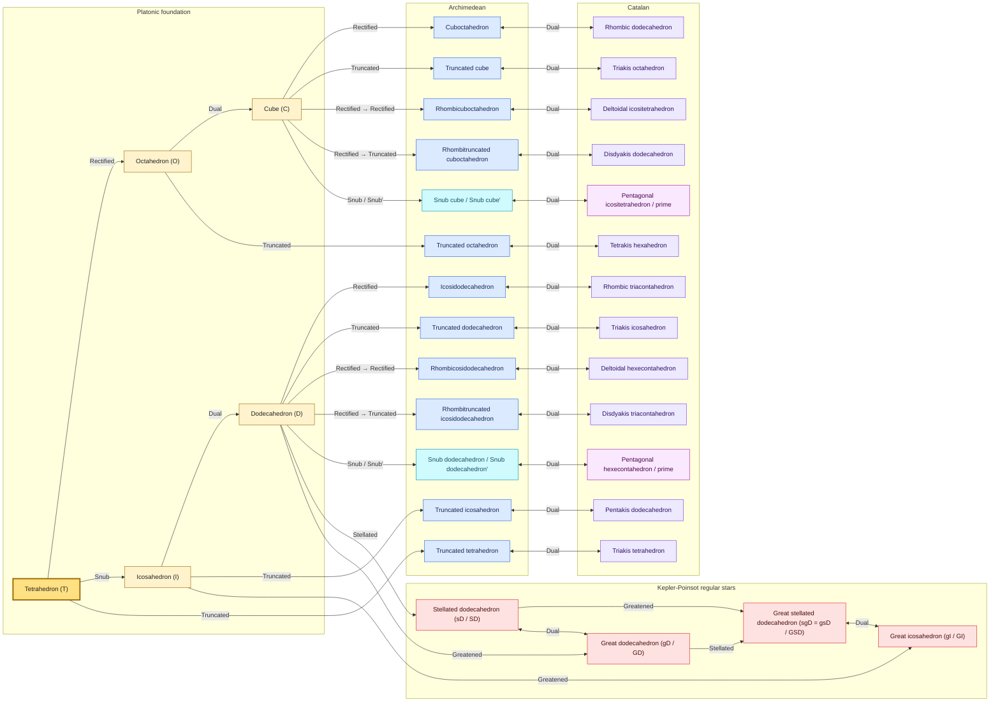

# Seed catalog

Polyhedra Explorer contains the complete classical catalog of 31 convex fixed
seed types: 5 Platonic, 13 Archimedean, and 13 Catalan solids, plus all four
regular non-convex Kepler-Poinsot solids. It also provides four ordinary parameterized
families—Prism, Antiprism, Pyramid, and Bipyramid—for every `n` from 3 through 100,
plus their regular-star analogues for every canonical `(n, q)` pair. The two chiral
Archimedean solids and their Catalan duals
also have prime-tagged mirror forms.

## Categories

### Platonic solids

A Platonic solid is a convex regular polyhedron: every face is the same regular
polygon, and the same arrangement of faces meets at every vertex. Equivalently,
its symmetry group is transitive on faces, edges, and vertices. Exactly five
exist.

### Families

A family is an infinite polyhedron class represented here by the finite range
`3 <= n <= 100`, where `n` is the order of the base or equatorial polygon.
Prisms and antiprisms use uniform coordinates; pyramids place a regular base and
centered apex on one sphere with centroid at the origin; bipyramids use a regular
equator and opposite spherical poles. Popup entries show only the family name.
The remembered size starts at `n = 3`; up/down controls beside the selected seed
change it without changing family. Popup selection and left/right seed navigation
carry the remembered `n` to another family and retain it while navigating through
fixed seeds, including with a transform chain. Removing transforms does not clear
the memory; the delete/reset control clears it to 3 only when invoked with no
transforms. Some low-order members coincide with fixed seeds and receive optional
replacement suggestions: Prism 4 is Cube, Antiprism 3 and Bipyramid 4 are
Octahedron, and Pyramid 3 is Tetrahedron. Those coincident members display the
stronger polyhedral symmetry and its actual orbit counts rather than the
family's normal axial point group.

### Star families

Star prism, Star antiprism, Star pyramid, and Star bipyramid use the same abstract
family topologies with each base or equatorial boundary traversed as the regular star
polygon `{n/q}`. A member is unique and valid when `3 <= n <= 100`, `2 <= q <= 10`,
`q < n / 2`, and `gcd(n, q) = 1`. The menu shows family names; the initial member is
`5/2`, the pill shows a compact name such as **Prism 5/2**, Up/Down enumerates valid
`n` values while keeping `q`, and the gear controls `q` while keeping `n`. All four
families share one remembered pair. Their canonical URL tags are `SP<n>_<q>`,
`SA<n>_<q>`, `SY<n>_<q>`, and `SB<n>_<q>`.

The source star boundary remains authoritative for F/E/V, topology, symmetry, and
serialization. Per-face nonzero-winding cells supply display triangles. Even-step star
antiprisms have aligned rings and point group `D_nh`; odd-step members retain the
half-step offset and point group `D_nd`.

### Archimedean solids

An Archimedean solid is a convex, vertex-transitive polyhedron whose faces are
regular polygons of a common edge length, with at least two polygon types. This
is the classical set of 13, excluding the Platonic solids and the infinite prism
and antiprism families. The snub cube and snub dodecahedron are chiral and each
has two mirror realizations.

### Catalan solids

A Catalan solid is the dual of an Archimedean solid. Its faces are congruent and
the symmetry group is face-transitive, but the faces are generally not regular
polygons and its vertices are not all equivalent. There are 13 types. The duals
of the two snub solids are chiral and also have two mirror realizations.

### Kepler-Poinsot solids

A Kepler-Poinsot solid is a regular non-convex polyhedron: every classical face is the same
regular polygon or pentagram, and every classical vertex has the same vertex figure. Exactly four
exist. The authoritative polyhedron is the classical immersed source surface, so the UI reports
its abstract F/E/V and regular-map orbits. Each face also carries derived nonzero-winding cells for
rendering and picking without changing that topology. The explicit Resolve operation converts the
complete immersion to an embedded physical boundary when a downstream operation needs one. This
category is last in the seed popup, whose entries use solid names only. See
[Self-intersecting polyhedra](self-intersections.md) for the geometry contracts and resolution
design.

The conventional Conway forms are `sD`, `gD`, `sgD = gsD`, and `gI`. URL seed tags use the
unambiguous uppercase `SD`, `GD`, `GSD`, and `GI`; lowercase `sD` denotes Snub dodecahedron.

## Reading the catalog

- Counts and orbit counts use UI order: faces, edges, vertices (`F / E / V`).
- Orbit counts are the project's proper-rotation orbits. Reflections are not
  used, so an achiral solid can have two mirror-related rotational orbits that
  its full symmetry group would merge.
- Point groups use the full Schoenflies notation shown in the UI. Subscripts
  encode orientation-reversing symmetry: `C_nv` has vertical mirrors, `D_nh`
  has vertical and horizontal mirrors, and `D_nd` has diagonal mirrors.
  `T_d`, `O_h`, and `I_h` are the full tetrahedral, octahedral, and icosahedral
  point groups. Bare `T`, `O`, and `I` are chiral and have no reflection
  planes. See [Symmetries](symmetries.md).
- A construction `Cube + t` means: select Cube, then apply Truncated (`t`); an
  arrow separates consecutive primitive operations. Names and tags link to the
  complete [transformation reference](transformations.md).
- A slash in a chiral construction gives the unprimed/prime operation respectively.
  For example, `C + s/s'` builds `sC/sC'`. Prime marks distinguish the two
  project representations; they do not assign universal *laevo* or *dextro*
  labels, which can reverse under duality.

## Primitive construction graph

Every fixed seed can be reached from one basic seed—Tetrahedron—using only the
primitive Rectified, Truncated, Dual, Snub, Greatened, and Stellated operations. Labels containing two
operations are literal sequences, not macro names. The Archimedean and Catalan
columns are paired by bidirectional Dual edges: applying Dual in either direction
crosses between a solid and its dual. A slash on a chiral node or edge covers
both tested handed forms. The core's composition-aware evaluation gives the
adjacent `Rectified → Rectified` and `Rectified → Truncated` sequences their
regular uniform geometry while retaining the explicit primitive operations.

The construction test executes every arrow above through the core, including
both directions of every Dual edge and both chiralities. It also proves that all
fixed catalog tags are reachable from `T`, constructs each one along that full
path, and rejects macro tags in the edge list. The regular-star construction test separately proves
both commuting paths to the great stellated dodecahedron and the two Kepler-Poinsot Dual pairs.

## Catalog summary

### Platonic

| Seed (tag) | Common alternative names | Dual | `F / E / V` | Full point group | `F / E / V` orbits | Primitive construction |
| --- | --- | --- | --- | --- | --- | --- |
| Tetrahedron (`T`) | Regular triangular pyramid | Tetrahedron | `4 / 6 / 4` | `T_d` | `1 / 1 / 1` | Basic seed |
| Cube (`C`) | Regular hexahedron | Octahedron | `6 / 12 / 8` | `O_h` | `1 / 1 / 1` | `O + d` |
| Octahedron (`O`) | — | Cube | `8 / 12 / 6` | `O_h` | `1 / 1 / 1` | `T + a` |
| Dodecahedron (`D`) | — | Icosahedron | `12 / 30 / 20` | `I_h` | `1 / 1 / 1` | `I + d` |
| Icosahedron (`I`) | — | Dodecahedron | `20 / 30 / 12` | `I_h` | `1 / 1 / 1` | `T + s` |

### Families

| Seed (tag) | Common alternative names | Dual | `F / E / V` | Full point group | `F / E / V` orbits | Construction |
| --- | --- | --- | --- | --- | --- | --- |
| Prism (`P3`–`P100`) | `n`-gonal prism | Bipyramid `n` | `n+2 / 3n / 2n` | `D_nh` | normally `2 / 2 / 1` | Family seed |
| Antiprism (`A3`–`A100`) | `n`-gonal antiprism | `n`-gonal trapezohedron | `2n+2 / 4n / 2n` | `D_nd` | normally `2 / 3 / 1` | Family seed |
| Pyramid (`Y3`–`Y100`) | `n`-gonal pyramid | Pyramid `n` | `n+1 / 2n / n+1` | `C_nv` | normally `2 / 2 / 2` | Family seed |
| Bipyramid (`B3`–`B100`) | Dipyramid; `n`-gonal bipyramid | Prism `n` | `2n / 3n / n+2` | `D_nh` | normally `1 / 2 / 2` | Family seed |

### Star families

| Seed (tag pattern) | Base face | `F / E / V` | Full point group | `F / E / V` orbits | Construction |
| --- | --- | --- | --- | --- | --- |
| Star prism (`SP<n>_<q>`) | `{n/q}` | `n+2 / 3n / 2n` | `D_nh` | normally `2 / 2 / 1` | Family seed |
| Star antiprism (`SA<n>_<q>`) | `{n/q}` | `2n+2 / 4n / 2n` | `D_nh` for even `q`; `D_nd` for odd `q` | normally `2 / 3 / 1` | Family seed |
| Star pyramid (`SY<n>_<q>`) | `{n/q}` | `n+1 / 2n / n+1` | `C_nv` | normally `2 / 2 / 2` | Family seed |
| Star bipyramid (`SB<n>_<q>`) | `{n/q}` equator | `2n / 3n / n+2` | `D_nh` | normally `1 / 2 / 2` | Family seed |

### Archimedean

| Seed (tag) | Common alternative names | Dual | `F / E / V` | Full point group | `F / E / V` orbits | Primitive construction |
| --- | --- | --- | --- | --- | --- | --- |
| Truncated tetrahedron (`tT`) | — | Triakis tetrahedron | `8 / 18 / 12` | `T_d` | `2 / 2 / 1` | `T + t` |
| Cuboctahedron (`aC`) | — | Rhombic dodecahedron | `14 / 24 / 12` | `O_h` | `2 / 1 / 1` | `C + a` |
| Truncated cube (`tC`) | — | Triakis octahedron | `14 / 36 / 24` | `O_h` | `2 / 2 / 1` | `C + t` |
| Truncated octahedron (`tO`) | — | Tetrakis hexahedron | `14 / 36 / 24` | `O_h` | `2 / 2 / 1` | `O + t` |
| Rhombicuboctahedron (`eC`) | Small rhombicuboctahedron | Deltoidal icositetrahedron | `26 / 48 / 24` | `O_h` | `3 / 2 / 1` | `C + a → a` |
| Rhombitruncated cuboctahedron (`bC`) | Truncated cuboctahedron; great rhombicuboctahedron | Disdyakis dodecahedron | `26 / 72 / 48` | `O_h` | `3 / 3 / 2` | `C + a → t` |
| Snub cube (`sC`, `sC'`) | — | Pentagonal icositetrahedron | `38 / 60 / 24` | `O` | `3 / 3 / 1` | `C + s/s'` |
| Icosidodecahedron (`aD`) | — | Rhombic triacontahedron | `32 / 60 / 30` | `I_h` | `2 / 1 / 1` | `D + a` |
| Truncated dodecahedron (`tD`) | — | Triakis icosahedron | `32 / 90 / 60` | `I_h` | `2 / 2 / 1` | `D + t` |
| Truncated icosahedron (`tI`) | Soccer-ball solid; buckyball shape | Pentakis dodecahedron | `32 / 90 / 60` | `I_h` | `2 / 2 / 1` | `I + t` |
| Rhombicosidodecahedron (`eD`) | Small rhombicosidodecahedron | Deltoidal hexecontahedron | `62 / 120 / 60` | `I_h` | `3 / 2 / 1` | `D + a → a` |
| Rhombitruncated icosidodecahedron (`bD`) | Truncated icosidodecahedron; great rhombicosidodecahedron | Disdyakis triacontahedron | `62 / 180 / 120` | `I_h` | `3 / 3 / 2` | `D + a → t` |
| Snub dodecahedron (`sD`, `sD'`) | — | Pentagonal hexecontahedron | `92 / 150 / 60` | `I` | `3 / 3 / 1` | `D + s/s'` |

### Catalan

| Seed (tag) | Common alternative names | Dual | `F / E / V` | Full point group | `F / E / V` orbits | Primitive construction |
| --- | --- | --- | --- | --- | --- | --- |
| Triakis tetrahedron (`dtT`) | Tristetrahedron | Truncated tetrahedron | `12 / 18 / 8` | `T_d` | `1 / 2 / 2` | `tT + d` |
| Rhombic dodecahedron (`daC`) | — | Cuboctahedron | `12 / 24 / 14` | `O_h` | `1 / 1 / 2` | `aC + d` |
| Triakis octahedron (`dtC`) | Small triakis octahedron; trisoctahedron | Truncated cube | `24 / 36 / 14` | `O_h` | `1 / 2 / 2` | `tC + d` |
| Tetrakis hexahedron (`dtO`) | Tetrahexahedron | Truncated octahedron | `24 / 36 / 14` | `O_h` | `1 / 2 / 2` | `tO + d` |
| Deltoidal icositetrahedron (`deC`) | Trapezoidal icositetrahedron; strombic icositetrahedron | Rhombicuboctahedron | `24 / 48 / 26` | `O_h` | `1 / 2 / 3` | `eC + d` |
| Disdyakis dodecahedron (`dbC`) | Hexakis octahedron; hexoctahedron | Rhombitruncated cuboctahedron | `48 / 72 / 26` | `O_h` | `2 / 3 / 3` | `bC + d` |
| Pentagonal icositetrahedron (`dsC`, `dsC'`) | — | Snub cube | `24 / 60 / 38` | `O` | `1 / 3 / 3` | `sC/sC' + d` |
| Rhombic triacontahedron (`daD`) | — | Icosidodecahedron | `30 / 60 / 32` | `I_h` | `1 / 1 / 2` | `aD + d` |
| Triakis icosahedron (`dtD`) | — | Truncated dodecahedron | `60 / 90 / 32` | `I_h` | `1 / 2 / 2` | `tD + d` |
| Pentakis dodecahedron (`dtI`) | — | Truncated icosahedron | `60 / 90 / 32` | `I_h` | `1 / 2 / 2` | `tI + d` |
| Deltoidal hexecontahedron (`deD`) | Trapezoidal hexecontahedron; strombic hexecontahedron | Rhombicosidodecahedron | `60 / 120 / 62` | `I_h` | `1 / 2 / 3` | `eD + d` |
| Disdyakis triacontahedron (`dbD`) | Hexakis icosahedron | Rhombitruncated icosidodecahedron | `120 / 180 / 62` | `I_h` | `2 / 3 / 3` | `bD + d` |
| Pentagonal hexecontahedron (`dsD`, `dsD'`) | — | Snub dodecahedron | `60 / 150 / 92` | `I` | `1 / 3 / 3` | `sD/sD' + d` |

### Kepler-Poinsot

| Seed (URL tag; Conway form) | Schläfli symbol | Dual | `F / E / V` | Full point group | `F / E / V` orbits | Primitive construction |
| --- | --- | --- | --- | --- | --- | --- |
| Stellated dodecahedron (`SD`; `sD`) | `{5/2, 5}` | Great dodecahedron | `12 / 30 / 12` | `I_h` | `1 / 1 / 1` | `D + S` |
| Great dodecahedron (`GD`; `gD`) | `{5, 5/2}` | Stellated dodecahedron | `12 / 30 / 12` | `I_h` | `1 / 1 / 1` | `D + G` |
| Great stellated dodecahedron (`GSD`; `sgD = gsD`) | `{5/2, 3}` | Great icosahedron | `12 / 30 / 20` | `I_h` | `1 / 1 / 1` | `D + G -> S` or `D + S -> G` |
| Great icosahedron (`GI`; `gI`) | `{3, 5/2}` | Great stellated dodecahedron | `20 / 30 / 12` | `I_h` | `1 / 1 / 1` | `I + G` |

## Completeness and validation

- The fixed catalog contains 35 unique base tags: exactly 5 Platonic, 13 Archimedean,
  13 Catalan, and 4 Kepler-Poinsot types. These match the complete classical
  enumerations of their categories. The four ordinary family selectors add 392 concrete members;
  the four star-family selectors add 1,844 canonical `(family, n, q)` members.
- The 13 Catalan rows pair one-to-one with the 13 Archimedean rows. Every pair
  has the same `E`, exchanged `F` and `V`, the same point group, and exchanged
  face/vertex orbit counts, as duality requires.
- Every embedded row satisfies Euler's formula `F - E + V = 2`. Immersed Kepler-Poinsot and
  star-family rows retain their abstract-map counts; derived arrangement cells do not alter them.
- The four chiral types add `sC'`, `sD'`, `dsC'`, and `dsD'` to the core without
  adding new solid types. Thus the UI lists 35 fixed types plus four family
  ordinary-family selectors and four star-family selectors, while the core supports 39 handed
  fixed representations, 392 ordinary-family members, and 1,844 star-family members.
- Fixed-row `F / E / V` and orbit counts are derived from each `Seed.poly`.
  The validation suite checks representative members of every family through
  `n = 100` against their formulas and independently validates each generated
  mesh. The convex construction suite evaluates all handed directed variants of its
  diagram edges through the core and recognizes the stated target, including
  both directions of Dual and prime chirality. The regular-star suite validates every
  construction edge and both Kepler-Poinsot Dual pairs. Path assertions prove
  that Tetrahedron alone reaches and constructs all 39 handed fixed representations.
- Runtime symmetry tests independently recover the full point group,
  proper-rotation orbit counts, and mirror-plane counts of every fixed seed plus
  representative ordinary and star axial families directly from geometry, including chiral,
  strengthened, and even/odd star-antiprism cases.
- No Platonic, classical Archimedean, Catalan, or Kepler-Poinsot solid is missing. The prism and
  antiprism families plus the pyramid and bipyramid families are included;
  Johnson solids beyond pyramids and nonconvex uniform solids beyond the Kepler-Poinsot set
  remain outside this catalog.

## Sources of truth

- Fixed seed definitions: [`Seed.kt`](../core/src/commonMain/kotlin/poly/Seed.kt).
- Classical regular-star source geometry: [`KeplerPoinsot.kt`](../core/src/commonMain/kotlin/poly/KeplerPoinsot.kt).
- Family seed definitions and geometry: [`FamilySeed.kt`](../core/src/commonMain/kotlin/poly/FamilySeed.kt).
- UI seed types and prime variants: [`CoreOptions.kt`](../web/src/jsMain/kotlin/catalog/CoreOptions.kt).
- Tested construction edges: [`SeedConstructionTest.kt`](../core/src/commonTest/kotlin/SeedConstructionTest.kt).
- Operation definitions: [Transformations and macros](transformations.md).
- [Wolfram MathWorld: Platonic Solid](https://mathworld.wolfram.com/PlatonicSolid.html).
- [Wolfram MathWorld: Archimedean Solid](https://mathworld.wolfram.com/ArchimedeanSolid.html).
- [Wolfram MathWorld: Archimedean Dual](https://mathworld.wolfram.com/ArchimedeanDual.html).
- [George W. Hart: Archimedean Duals](https://georgehart.com/virtual-polyhedra/archimedean-duals-info.html).
- [George W. Hart: Kepler-Poinsot Polyhedra](https://www.georgehart.com/virtual-polyhedra/kepler-poinsot-info.html).
- [George W. Hart: Stellations](https://www.georgehart.com/virtual-polyhedra/stellations-info.html).
