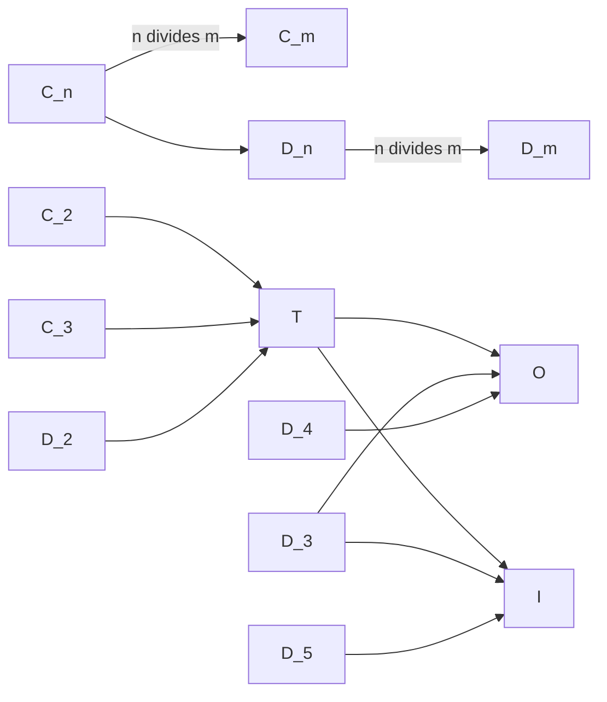

# Symmetries

Polyhedra Explorer reports the **proper rotational symmetry class** of the
current geometry. Proper rotations preserve orientation; reflections and other
orientation-reversing operations are tracked separately. The compact class is
shown to the right of the bottom F/E/V counts. Its tooltip gives the full class
name and the numbers of rotation axes and reflection planes that can be
displayed.

## Compact notation

| UI notation | Name | Proper rotations | Distinct axes | Description |
| --- | --- | ---: | ---: | --- |
| `C<n>` | `n`-fold cyclic | `n` | 1 | Rotations around one principal axis, such as `C7` for a heptagonal pyramid. |
| `D<n>` | `n`-fold dihedral | `2n` | `n + 1` | The `C<n>` rotations plus `n` half-turns around axes perpendicular to the principal axis, such as `D8` for an octagonal prism. |
| `T` | Tetrahedral | 12 | 7 | The proper rotations of a tetrahedron. |
| `O` | Octahedral | 24 | 13 | The proper rotations shared by a cube and an octahedron. |
| `I` | Icosahedral | 60 | 31 | The proper rotations shared by a dodecahedron and an icosahedron. |

The seed catalog also gives the full Schoenflies point group. Subscripts encode
orientation-reversing symmetry: `C_nv` has `n` vertical mirrors, `D_nh` adds a
horizontal mirror to the vertical mirrors, and `D_nd` has diagonal vertical
mirrors. `T_d`, `O_h`, and `I_h` are the full achiral tetrahedral, octahedral,
and icosahedral groups. A bare `T`, `O`, or `I` is chiral and has no reflection
planes.

## Geometry exploration

Clicking the symmetry pill toggles every rotation axis and reflection plane
found in the current geometry. Each physical rotation axis is drawn once as a
thin black line through the origin, even when several rotation angles share it.
Each reflection plane is a translucent circular disk centered at the origin.
A chiral geometry has no reflection planes, but its proper-rotation axes remain
available, so the pill remains interactive.

The config popup's Symmetry group controls both overlays relative to the
current circumradius. Plane size defaults to `1.1` and Axis size to `1.2`, so
the black lines project slightly beyond the disks. Both multipliers range from
`1.0` to `2.0`. The overlay's visibility and non-default size values are stored
in the URL and restored on reload.

The Wasm core derives symmetries from the actual coordinates and connectivity,
not from the seed name or inherited kind labels. It enumerates the proper and
improper orthogonal automorphisms of a directed-edge frame, verifies their
vertex and edge permutations, forms the resulting F/E/V rotation orbits, and
keeps the distinct fixed axes of non-identity proper rotations and the improper
involutions whose fixed set is a plane. Consequently, the UI can report
symmetry that becomes stronger after a special construction.

## How symmetry can strengthen

Every transform is equivariant under the input's proper rotations: applying a
rotation before or after the transform gives the same result. The proper
rotational group therefore cannot become weaker. At special coordinates,
previously distinct orbits can coincide and the result can acquire a larger
group. For example, Snub applied to a tetrahedron produces an icosahedron, so
`T` becomes `I` and its F/E/V orbit counts collapse to one each.

The following diagram shows the finite rotational-group inclusions relevant to
the catalog. An arrow means that the group at its tail can be a subgroup of the
group at its head; it does not mean every transform makes that promotion. In
the first two rows, `n` must divide `m`.

This monotonic statement concerns proper rotations, which are what the compact
pill and orbit counts use. A chiral transform such as Snub or Gyro preserves all
proper rotations but can remove reflection planes; the plane portion of the
overlay therefore changes independently of the rotational class while its axes
remain.

## Orbit counts

The bottom counts use `total/orbits` when an element type has more than one
proper-rotation orbit, and show only the total when there is one. Thus a snub
cube displays `F: 38/3`, `E: 60/3`, and `V: 24`. Orbit counts are calculated
from the current geometric automorphism group, so they also collapse when the
symmetry strengthens.
