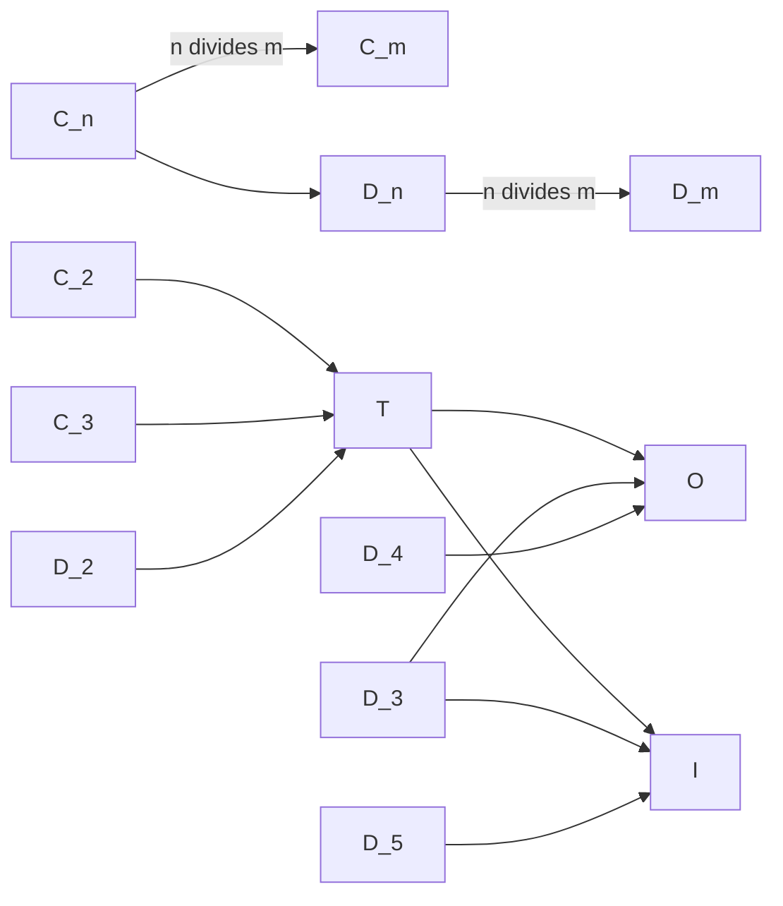

# Symmetries

Polyhedra Explorer reports the current geometry's **full Schoenflies point
group**. A point group contains every orthogonal symmetry that fixes the
origin: proper rotations and, when present, reflections, inversion, and
rotoreflections. The point-group pill appears to the right of the bottom F/E/V
counts. It uses an HTML subscript for the fold and suffix, while its tooltip
gives the full group name and the numbers of rotation axes and reflection
planes that can be displayed.

## Point-group notation

| Notation | Name | Proper rotations | Distinct axes | Reflection planes | Description |
| --- | --- | ---: | ---: | ---: | --- |
| `C_n` | Cyclic | `n` | 1 | 0 | Chiral rotations around one principal axis. |
| `C_nv` | Pyramidal | `n` | 1 | `n` | `C_n` plus `n` vertical mirrors, as in an `n`-gonal pyramid. |
| `C_nh` | Cyclic with horizontal mirror | `n` | 1 | 1 | `C_n` plus a mirror perpendicular to the principal axis. |
| `S_2n` | Improper rotation | `n` | 1 | 0 | Generated by a `2n`-fold rotoreflection; its proper subgroup is `C_n`. |
| `D_n` | Chiral dihedral | `2n` | `n + 1` | 0 | `C_n` plus `n` perpendicular half-turn axes. |
| `D_nh` | Prismatic | `2n` | `n + 1` | `n + 1` | Dihedral rotations with vertical and horizontal mirrors, as in a prism or bipyramid. |
| `D_nd` | Antiprismatic | `2n` | `n + 1` | `n` | Dihedral rotations with diagonal mirrors, as in an antiprism. |
| `T` | Chiral tetrahedral | 12 | 7 | 0 | The proper rotations of a tetrahedron. |
| `T_d` | Full tetrahedral | 12 | 7 | 6 | Tetrahedral rotations and diagonal mirrors. |
| `T_h` | Pyritohedral | 12 | 7 | 3 | Tetrahedral rotations with inversion and horizontal mirrors. |
| `O` | Chiral octahedral | 24 | 13 | 0 | The proper rotations shared by a cube and octahedron. |
| `O_h` | Full octahedral | 24 | 13 | 9 | All cube/octahedron rotations and orientation-reversing symmetries. |
| `I` | Chiral icosahedral | 60 | 31 | 0 | The proper rotations shared by a dodecahedron and icosahedron. |
| `I_h` | Full icosahedral | 60 | 31 | 15 | All dodecahedron/icosahedron rotations and orientation-reversing symmetries. |

The core identifies the suffix from the complete orientation-reversing coset,
not from a seed label. In the UI, notation such as `D_7h` is rendered as
`D7h` rather than as baseline text.

## Geometry exploration

Clicking the point-group pill toggles every rotation axis and reflection plane
found in the current geometry. Each physical rotation axis is drawn once as a
thin black line through the origin, even when several rotation angles share it.
Each reflection plane is a translucent circular disk centered at the origin.
A chiral geometry has no reflection planes, but its rotation axes remain
available, so the pill remains interactive. Orientation-reversing operations
with no mirror plane, such as a pure rotoreflection, affect the reported point
group but do not add a plane to the overlay.

The config popup's Symmetry group controls both overlays relative to the
current circumradius. Plane size defaults to `1.1` and Axis size to `1.2`, so
the black lines project slightly beyond the disks. Both multipliers range from
`1.0` to `2.0`. The overlay's visibility and non-default size values are stored
in the URL and restored on reload.

The Wasm core derives symmetries from the actual coordinates and connectivity,
not from the seed name or inherited kind labels. It enumerates proper and
improper orthogonal automorphisms of a directed-edge frame, verifies their
vertex and edge permutations, forms the resulting F/E/V rotation orbits, and
keeps the distinct fixed axes of non-identity proper rotations and the improper
involutions whose fixed set is a plane. Consequently, the UI can report a point
group that becomes larger after a special construction.

## How symmetry can change

Every transform is equivariant under the input's proper rotations: applying a
rotation before or after the transform gives the same result. The proper
rotation subgroup therefore cannot become weaker. At special coordinates,
previously distinct orbits can coincide and the result can acquire more proper
rotations. For example, Snub applied to a tetrahedron produces an icosahedron,
so `T_d` becomes `I_h` and its F/E/V orbit counts collapse to one each.

The following diagram shows the finite proper-rotation subgroup inclusions
relevant to the catalog. An arrow means that the group at its tail can be a
subgroup of the group at its head; it does not mean every transform makes that
promotion. In the first two rows, `n` must divide `m`.

The full point group also records orientation-reversing symmetries. A chiral
transform such as Snub or Gyro preserves all proper rotations but can remove
reflection planes, changing—for example—`O_h` to `O`. Conversely, a special
coordinate realization can acquire mirrors or other orientation-reversing
operations as well as extra rotations.

## Orbit counts

The bottom counts use `total/orbits` when an element type has more than one
proper-rotation orbit, and show only the total when there is one. Thus a snub
cube displays `F: 38/3`, `E: 60/3`, and `V: 24`. Orbit counts are calculated
from the current geometric proper-rotation subgroup, so they also collapse when
rotational symmetry strengthens.
